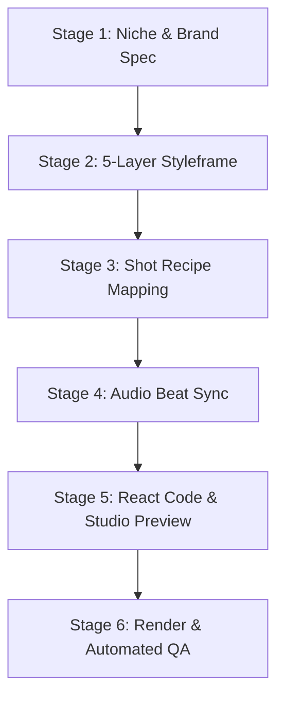

# The Ultimate Viral Growth Playbook (2026 Edition)
## How to Scale Instagram Reels, TikTok & Twitter/X to 10k+ Followers & Achieve Consistent Virality

> **Gathered using Agent-Reach, live Reddit analysis, Twitter/X creator insights, algorithmic retention frameworks, motion design engineering, Remotion React video mechanics, and top open-source repositories.**

---

## Executive Summary & The 2026 Social Algorithm Reality

Growing an audience to 10,000+ followers across Instagram Reels, TikTok, and Twitter/X in 2026 is no longer about high-budget production, luck, or spamming 30 hashtags. The algorithms have evolved into hyper-efficient **Interest Graphs** governed by **retention math** and **social utility signals**.

---

## 1. The 0 to 10k Followers Phased Blueprint

### Phase 1: 0 – 1,000 Followers (Algorithm Calibration & Foundation)
* **Goal:** Teach the algorithm who your content is for and establish baseline posting consistency.
* **Niche Hyper-Focus:** Do not post generic content. Define a tight sub-niche (e.g., instead of "Fitness", focus on "15-Minute Kettlebell Workouts for Busy Professionals").
* **Posting Frequency:** 1 to 2 times daily on TikTok; 1 reel daily + 1 carousel daily on Instagram; 2–3 value tweets/threads daily on X.
* **Video Length:** Target 15–25 seconds. Short, high-density videos make it easier to hit >100% completion rates during early account seeding.

### Phase 2: 1,000 – 5,000 Followers (Retention & DM Share Expansion)
* **Goal:** Turn initial viewers into raving fans using "Save Magnets" and "Send-Bait".
* **Trial Reels (Instagram):** If eligible, post cold-audience tests via Instagram Trial Reels before publishing to your follower feed.
* **Content Formats:** Mix 70% short educational/relatable short-form video with 30% deep-value carousel slides (Instagram) or 60s+ structured explainer scripts (TikTok Creator Rewards).

### Phase 3: 5,000 – 10,000 Followers (Systematization & Scale)
* **Goal:** Double down on proven repeatable formats and maximize conversion to profile visits.
* **Repeatable Series:** Build 2–3 named content series (e.g., "Day X of testing Y", "3-Minute Fixes for Z").
* **Bio & Profile Funnel:** Optimize your profile bio with a clear promise statement ("I help [Target Audience] achieve [Specific Result]") and a pinned 3-video sequence.

---

## 2. Algorithm Metrics & Ranking Hierarchies

### Instagram Reels Ranking Hierarchy
1. **Sends per Reach (DM Shares):** The highest weighted signal. Indicates high trust and social recommendation.
2. **Watch Time & 3-Second Retention:** Holding viewers past second 3 prevents algorithmic drop-off.
3. **Saves:** Signals future utility (reference value).

### TikTok FYP Ranking Hierarchy
1. **Completion Rate & Rewatches:** 
   - Sub-15s videos: Require **>100%** completion (must loop).
   - 15–30s videos: Require **~70%** completion.
2. **First 3 Seconds Retention:** 85%+ retention past second 3 leads to exponential FYP expansion.

### Twitter / X Ranking Hierarchy
1. **Video Completion & Watch Time:** Native video uploads get major algorithmic boosting in the For You feed.
2. **Bookmark & Repost Velocity:** Bookmarks serve as X's equivalent of "saves".

---

## 3. The 3-Layer Viral Hook Framework

A viral hook requires **3 synchronized layers** active in the first 1.5 to 3 seconds:

| Layer | Component | Function | Example |
| :--- | :--- | :--- | :--- |
| **Layer 1: Visual** | Pattern Interrupt / Motion | Stops physical scrolling | Sudden movement, price drop visual, side-by-side comparison |
| **Layer 2: Verbal** | Direct, concrete opening line | Hooks auditory processing | *"Your $300 coffee setup is why it tastes worse."* |
| **Layer 3: Text Overlay** | Bold 3-7 word subtitle | Hooks silent scrollers (80%+ of viewers) | `"$300 vs $39 Setup"` |

---

## 4. Master Rules for Viral Motion Graphics, Visuals & Pacing

### 1. Motion Layers (The 3-Layer Visual Rule)
Never render a flat animation with a single moving piece. Every scene must have 3 motion layers:
* **Primary Layer:** The hero element the viewer's eye follows (e.g., card entry, camera zoom).
* **Secondary Layer:** Supporting physical feedback (e.g., shadow expansion, icon tilt, accent border highlight).
* **Ambient Layer:** Subtle continuous environment life (e.g., 1–2% gradient pulse, floating noise field, micro-parallax).

### 2. Motion Personalities & Easing Curves
Never use linear transitions for spatial movement (linear is reserved strictly for loading spinners and progress bars).
* **Playful / High Energy:** `150-250ms`, Easing: `ease-out-back` or `cubic-bezier(0.175, 0.885, 0.32, 1.275)` (10–20% overshoot).
* **Premium / Luxury:** `350-500ms`, Easing: `cubic-bezier(0.4, 0, 0.2, 1)` (0% overshoot, heavy damping).
* **Snappy UI / Corporate:** `200-350ms`, Easing: `cubic-bezier(0.2, 0, 0, 1)` (Material 3 Emphasized Deceleration).

---

## 5. Deep-Dive: Building Viral Motion Graphics with Remotion

### 1. Code Rules & Physics
* **No CSS Animations:** Always use `useCurrentFrame()`, `interpolate()`, or `spring()`.
* **Always Clamp Interpolations:** Add `{ extrapolateLeft: "clamp", extrapolateRight: "clamp" }`.
* **2–3 Property Compound Entrances:** Combine `opacity` + `translateY` + `scale`.
* **Derive Timing from FPS:** Use `useVideoConfig().fps`.

### 2. The 5-Layer Composition Stack
```
Layer 5 (Top): Grain & Vignette (Film Texture)
Layer 4: Color Grade (Contrast Tint / LUT)
Layer 3: Kinetic Typography & Visual Overlays
Layer 2: Asset Layer (2.5D Cards / <OffthreadVideo>)
Layer 1 (Bottom): Background Mesh (Radial Gradient Glow / Noise Field)
```

---

## 6. The 6-Stage Remotion Production Pipeline & Ecosystem

To produce high-converting, viral Remotion videos consistently, use this end-to-end programmatic pipeline paired with top open-source tools:

### Top Open-Source Repositories & Agent Skills

| Resource | Type | Purpose |
| :--- | :--- | :--- |
| **`remotion-dev/remotion`** | Core Engine | Programmatic React-to-MP4 video rendering engine. |
| **`remotion-dev/skills`** | Agent Skill | Official Remotion best practices knowledge base for AI coding agents (`npx skills add remotion-dev/skills`). |
| **`Vincentwei1021/video-shotcraft`** | Skill & Library | 152+ shot recipe cards, 209 motion previews, and 2.5D camera templates for cinema-grade product videos. |
| **`gyoridavid/short-video-maker`** | Automated Pipeline | REST API & serverless pipeline for automated TikTok/Reels generation. |
| **`openvideodev/react-video-editor`** | Web Visual UI | Browser-based visual editor built on top of Remotion. |
| **`@remotion/three`** | 3D Module | WebGL & Three.js canvas integration inside Remotion scenes. |
| **`@remotion/media`** | Media Primitive | `<OffthreadVideo>` component for lag-free, frame-accurate video rendering. |

---

### The 6-Stage Production Pipeline



#### Stage 1: Niche & Brand Spec
* Extract font family, font-weight hierarchy, color palette tokens, and layout grid from the target product.
* Define the primary **Motion Personality** (Playful, Premium, Corporate, or Energetic).

#### Stage 2: 5-Layer Styleframe Design
* Set up the 5-layer visual stack: Radial Mesh Background -> Product 2.5D Assets -> Kinetic Text -> Color Grade -> Film Grain & Vignette.
* Ensure all elements share a unified color token palette.

#### Stage 3: Shot Recipe Mapping
* Select 3 to 5 motion shot recipes from `video-shotcraft` or `remotion-motion-graphics`:
  * *Shot 1 (0-3s):* `spotlight-hero-card` (2.5D tilt + spotlight vignette).
  * *Shot 2 (3-10s):* `kinetic-word-reveal` (spring-based subtitles).
  * *Shot 3 (10-18s):* `deck-deal-flyin` (physics-based stacked card reveal).
  * *Shot 4 (18-22s):* `seamless-loop-settle` (final frame matching initial frame).

#### Stage 4: Audio Beat Analysis & Beat Sync (`beatF`)
* Run an audio transient detector (BPM & beat grid) before writing video code.
* Define visual cuts on beat frames using `beatF(n)` math so scene transitions hit exactly on drum transients.

#### Stage 5: Modular Code Generation & Studio Live Preview
* Write clean, modular React components using `spring()` physics and `useCurrentFrame()`.
* Preview in real time using **Remotion Studio** (`npm run dev`) before full rendering.

#### Stage 6: Headless Rendering & Automated QA Verification
* Render headless MP4 using `--codec h264 --crf 17`.
* Automatically extract key frames at 0.5s, 1.5s, and 3.0s using `npx remotion still`.
* Verify spacing, safe-zone margins (middle 75% for 9:16 vertical video), contrast over the grade, and non-linear spring motion.

---

## 7. Captions, Hashtags & SEO Strategy

1. **Line 1 (Keyword Anchor):** Include primary target keyword in sentence 1.
2. **Body:** 2–3 short paragraphs delivering value.
3. **CTA (Send Focus):** *"Send this to a friend building their account this year."*
4. **Hashtags:** **3 to 5 hyper-focused tags**.

---

## 8. Anti-Patterns That Demote Your Reach

* ❌ **Linear Easing on Spatial Move:** Makes motion look robotic and amateurish.
* ❌ **CSS Animations in Remotion:** Breaks frame accuracy and causes rendering glitches.
* ❌ **Throat-Clearing Intros:** *"Hey guys welcome back"* drops 3-second retention by 50–60%.
* ❌ **Third-Party Watermarks:** Reels algorithm automatically limits non-follower reach for videos containing TikTok/CapCut logos.

---

## 9. 1-to-5 Content Repurposing Engine

```
                  ┌──► Asset 1: 20s Fast Talking-Head Reel / TikTok
                  ├──► Asset 2: 7-Slide Educational Carousel (Instagram)
1 Core Topic ─────┼──► Asset 3: POV Visual Reel + Trending Audio
                  ├──► Asset 4: 60s+ Creator Rewards Deep Explainer
                  └──► Asset 5: Remotion Programmatic Motion Graphics Video
```

---

## 10. Daily Execution Checklist

- [ ] **Hook Verification:** Are all 3 layers (Visual, Verbal, Text) active in seconds 0–3?
- [ ] **First 1.5s Trim:** Has all dead air and intro setup been cut?
- [ ] **Remotion Code Check:** Are `interpolate()` and `spring()` physics used without CSS transitions?
- [ ] **Visual Layers:** Is the 5-Layer stack present?
- [ ] **Audio Sync:** Are visual cuts aligned with beat grid frames (`beatF`)?
- [ ] **Automated QA:** Were keyframes extracted (`npx remotion still`) and verified before delivery?
